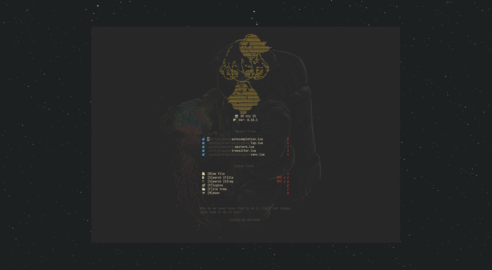
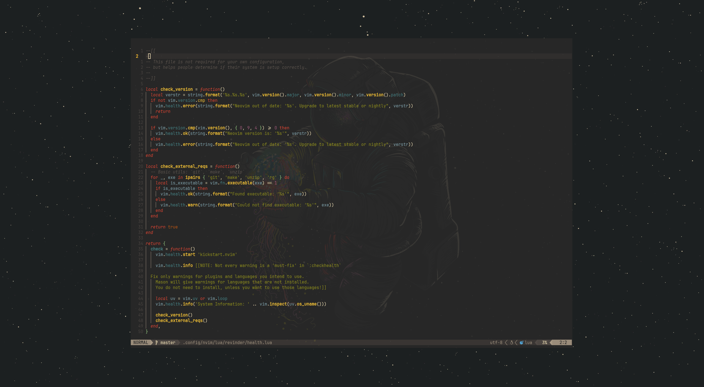

<p align="center">
     
</p>
<p align="center">
     
</p>


For more in-depth information, check out [my dotfiles](https://github.com/RevinderDev/.dotfiles).

##### Windows

If you are on windows, you might have issue with missing `sqlite.lua`[1] library and `python3` missing for mason [2].
Set appropriate paths in your environments: 

```.env
SQLITE_DLL_PATH=path/to/sqlite3.dll
NVIM_PYTHON3_VENV=path/to/python.exe
```

[1] https://github.com/kkharji/sqlite.lua#windows

[2] https://neovim.io/doc/user/provider.html
